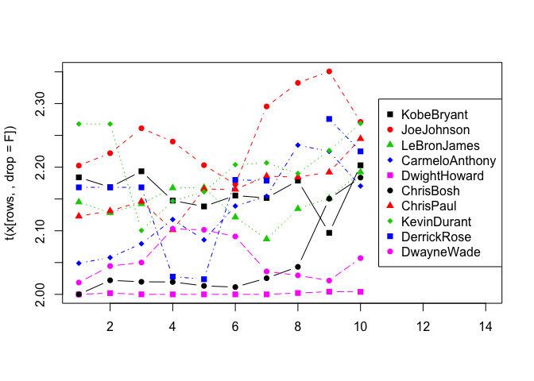

Basketball Data Analysis and Visualization
================

In this project I will use real basketball data in the form of vectors
to provide some quick analysis. I will analyze and visualize different
statistical metrics across many NBA players over several seasons, with
the goal being to answer statistical questions that could possibly arise
when dealing with this type of data. Below I have included a real-life
scenario of data.

Credit to [SuperDataScience](https://www.superdatascience.com/) for
providing the data in this format.

``` r
#Seasons
Seasons <- c("2005","2006","2007","2008","2009","2010","2011","2012","2013","2014")

#Players
Players <- c("KobeBryant","JoeJohnson","LeBronJames","CarmeloAnthony","DwightHoward","ChrisBosh","ChrisPaul","KevinDurant","DerrickRose","DwayneWade")

#Salary vectors
KobeBryant_Salary <- c(15946875,17718750,19490625,21262500,23034375,24806250,25244493,27849149,30453805,23500000)
JoeJohnson_Salary <- c(12000000,12744189,13488377,14232567,14976754,16324500,18038573,19752645,21466718,23180790)
LeBronJames_Salary <- c(4621800,5828090,13041250,14410581,15779912,14500000,16022500,17545000,19067500,20644400)
CarmeloAnthony_Salary <- c(3713640,4694041,13041250,14410581,15779912,17149243,18518574,19450000,22407474,22458000)
DwightHoward_Salary <- c(4493160,4806720,6061274,13758000,15202590,16647180,18091770,19536360,20513178,21436271)
ChrisBosh_Salary <- c(3348000,4235220,12455000,14410581,15779912,14500000,16022500,17545000,19067500,20644400)
ChrisPaul_Salary <- c(3144240,3380160,3615960,4574189,13520500,14940153,16359805,17779458,18668431,20068563)
KevinDurant_Salary <- c(0,0,4171200,4484040,4796880,6053663,15506632,16669630,17832627,18995624)
DerrickRose_Salary <- c(0,0,0,4822800,5184480,5546160,6993708,16402500,17632688,18862875)
DwayneWade_Salary <- c(3031920,3841443,13041250,14410581,15779912,14200000,15691000,17182000,18673000,15000000)

#Salary matrix
Salary <- rbind(KobeBryant_Salary, JoeJohnson_Salary, LeBronJames_Salary, CarmeloAnthony_Salary, DwightHoward_Salary, ChrisBosh_Salary, ChrisPaul_Salary, KevinDurant_Salary, DerrickRose_Salary, DwayneWade_Salary)
rm(KobeBryant_Salary, JoeJohnson_Salary, CarmeloAnthony_Salary, DwightHoward_Salary, ChrisBosh_Salary, LeBronJames_Salary, ChrisPaul_Salary, DerrickRose_Salary, DwayneWade_Salary, KevinDurant_Salary)
colnames(Salary) <- Seasons
rownames(Salary) <- Players

#Games played vectors
KobeBryant_G <- c(80,77,82,82,73,82,58,78,6,35)
JoeJohnson_G <- c(82,57,82,79,76,72,60,72,79,80)
LeBronJames_G <- c(79,78,75,81,76,79,62,76,77,69)
CarmeloAnthony_G <- c(80,65,77,66,69,77,55,67,77,40)
DwightHoward_G <- c(82,82,82,79,82,78,54,76,71,41)
ChrisBosh_G <- c(70,69,67,77,70,77,57,74,79,44)
ChrisPaul_G <- c(78,64,80,78,45,80,60,70,62,82)
KevinDurant_G <- c(35,35,80,74,82,78,66,81,81,27)
DerrickRose_G <- c(40,40,40,81,78,81,39,0,10,51)
DwayneWade_G <- c(75,51,51,79,77,76,49,69,54,62)

#Games played matrix
Games <- rbind(KobeBryant_G, JoeJohnson_G, LeBronJames_G, CarmeloAnthony_G, DwightHoward_G, ChrisBosh_G, ChrisPaul_G, KevinDurant_G, DerrickRose_G, DwayneWade_G)
rm(KobeBryant_G, JoeJohnson_G, CarmeloAnthony_G, DwightHoward_G, ChrisBosh_G, LeBronJames_G, ChrisPaul_G, DerrickRose_G, DwayneWade_G, KevinDurant_G)
colnames(Games) <- Seasons
rownames(Games) <- Players

#Minutes played vectors
KobeBryant_MP <- c(3277,3140,3192,2960,2835,2779,2232,3013,177,1207)
JoeJohnson_MP <- c(3340,2359,3343,3124,2886,2554,2127,2642,2575,2791)
LeBronJames_MP <- c(3361,3190,3027,3054,2966,3063,2326,2877,2902,2493)
CarmeloAnthony_MP <- c(2941,2486,2806,2277,2634,2751,1876,2482,2982,1428)
DwightHoward_MP <- c(3021,3023,3088,2821,2843,2935,2070,2722,2396,1223)
ChrisBosh_MP <- c(2751,2658,2425,2928,2526,2795,2007,2454,2531,1556)
ChrisPaul_MP <- c(2808,2353,3006,3002,1712,2880,2181,2335,2171,2857)
KevinDurant_MP <- c(1255,1255,2768,2885,3239,3038,2546,3119,3122,913)
DerrickRose_MP <- c(1168,1168,1168,3000,2871,3026,1375,0,311,1530)
DwayneWade_MP <- c(2892,1931,1954,3048,2792,2823,1625,2391,1775,1971)

#Minutes played matrix
Minutes <- rbind(KobeBryant_MP, JoeJohnson_MP, LeBronJames_MP, CarmeloAnthony_MP, DwightHoward_MP, ChrisBosh_MP, ChrisPaul_MP, KevinDurant_MP, DerrickRose_MP, DwayneWade_MP)
rm(KobeBryant_MP, JoeJohnson_MP, CarmeloAnthony_MP, DwightHoward_MP, ChrisBosh_MP, LeBronJames_MP, ChrisPaul_MP, DerrickRose_MP, DwayneWade_MP, KevinDurant_MP)
colnames(Minutes) <- Seasons
rownames(Minutes) <- Players

#Field goals vectors
KobeBryant_FG <- c(978,813,775,800,716,740,574,738,31,266)
JoeJohnson_FG <- c(632,536,647,620,635,514,423,445,462,446)
LeBronJames_FG <- c(875,772,794,789,768,758,621,765,767,624)
CarmeloAnthony_FG <- c(756,691,728,535,688,684,441,669,743,358)
DwightHoward_FG <- c(468,526,583,560,510,619,416,470,473,251)
ChrisBosh_FG <- c(549,543,507,615,600,524,393,485,492,343)
ChrisPaul_FG <- c(407,381,630,631,314,430,425,412,406,568)
KevinDurant_FG <- c(306,306,587,661,794,711,643,731,849,238)
DerrickRose_FG <- c(208,208,208,574,672,711,302,0,58,338)
DwayneWade_FG <- c(699,472,439,854,719,692,416,569,415,509)

#Field goals matrix
FieldGoals <- rbind(KobeBryant_FG, JoeJohnson_FG, LeBronJames_FG, CarmeloAnthony_FG, DwightHoward_FG, ChrisBosh_FG, ChrisPaul_FG, KevinDurant_FG, DerrickRose_FG, DwayneWade_FG)
rm(KobeBryant_FG, JoeJohnson_FG, LeBronJames_FG, CarmeloAnthony_FG, DwightHoward_FG, ChrisBosh_FG, ChrisPaul_FG, KevinDurant_FG, DerrickRose_FG, DwayneWade_FG)
colnames(FieldGoals) <- Seasons
rownames(FieldGoals) <- Players

#Field goal attempts vectors
KobeBryant_FGA <- c(2173,1757,1690,1712,1569,1639,1336,1595,73,713)
JoeJohnson_FGA <- c(1395,1139,1497,1420,1386,1161,931,1052,1018,1025)
LeBronJames_FGA <- c(1823,1621,1642,1613,1528,1485,1169,1354,1353,1279)
CarmeloAnthony_FGA <- c(1572,1453,1481,1207,1502,1503,1025,1489,1643,806)
DwightHoward_FGA <- c(881,873,974,979,834,1044,726,813,800,423)
ChrisBosh_FGA <- c(1087,1094,1027,1263,1158,1056,807,907,953,745)
ChrisPaul_FGA <- c(947,871,1291,1255,637,928,890,856,870,1170)
KevinDurant_FGA <- c(647,647,1366,1390,1668,1538,1297,1433,1688,467)
DerrickRose_FGA <- c(436,436,436,1208,1373,1597,695,0,164,835)
DwayneWade_FGA <- c(1413,962,937,1739,1511,1384,837,1093,761,1084)

#Field goal attempts matrix
FieldGoalAttempts <- rbind(KobeBryant_FGA, JoeJohnson_FGA, LeBronJames_FGA, CarmeloAnthony_FGA, DwightHoward_FGA, ChrisBosh_FGA, ChrisPaul_FGA, KevinDurant_FGA, DerrickRose_FGA, DwayneWade_FGA)
rm(KobeBryant_FGA, JoeJohnson_FGA, LeBronJames_FGA, CarmeloAnthony_FGA, DwightHoward_FGA, ChrisBosh_FGA, ChrisPaul_FGA, KevinDurant_FGA, DerrickRose_FGA, DwayneWade_FGA)
colnames(FieldGoalAttempts) <- Seasons
rownames(FieldGoalAttempts) <- Players

#Free throws vectors
KobeBryant_FT <- c(696,667,623,483,439,483,381,525,18,196)
JoeJohnson_FT <- c(261,235,316,299,220,195,158,132,159,141)
LeBronJames_FT <- c(601,489,549,594,593,503,387,403,439,375)
CarmeloAnthony_FT <- c(573,459,464,371,508,507,295,425,459,189)
DwightHoward_FT <- c(356,390,529,504,483,546,281,355,349,143)
ChrisBosh_FT <- c(474,463,472,504,470,384,229,241,223,179)
ChrisPaul_FT <- c(394,292,332,455,161,337,260,286,295,289)
KevinDurant_FT <- c(209,209,391,452,756,594,431,679,703,146)
DerrickRose_FT <- c(146,146,146,197,259,476,194,0,27,152)
DwayneWade_FT <- c(629,432,354,590,534,494,235,308,189,284)

#Free throws matrix
FreeThrows <- rbind(KobeBryant_FT, JoeJohnson_FT, LeBronJames_FT, CarmeloAnthony_FT, DwightHoward_FT, ChrisBosh_FT, ChrisPaul_FT, KevinDurant_FT, DerrickRose_FT, DwayneWade_FT)
rm(KobeBryant_FT, JoeJohnson_FT, LeBronJames_FT, CarmeloAnthony_FT, DwightHoward_FT, ChrisBosh_FT, ChrisPaul_FT, KevinDurant_FT, DerrickRose_FT, DwayneWade_FT)
colnames(FreeThrows) <- Seasons
rownames(FreeThrows) <- Players

#Free throw attempts vectors
KobeBryant_FTA <- c(819,768,742,564,541,583,451,626,21,241)
JoeJohnson_FTA <- c(330,314,379,362,269,243,186,161,195,176)
LeBronJames_FTA <- c(814,701,771,762,773,663,502,535,585,528)
CarmeloAnthony_FTA <- c(709,568,590,468,612,605,367,512,541,237)
DwightHoward_FTA <- c(598,666,897,849,816,916,572,721,638,271)
ChrisBosh_FTA <- c(581,590,559,617,590,471,279,302,272,232)
ChrisPaul_FTA <- c(465,357,390,524,190,384,302,323,345,321)
KevinDurant_FTA <- c(256,256,448,524,840,675,501,750,805,171)
DerrickRose_FTA <- c(205,205,205,250,338,555,239,0,32,187)
DwayneWade_FTA <- c(803,535,467,771,702,652,297,425,258,370)

#Free throw attempts matrix
FreeThrowAttempts <- rbind(KobeBryant_FTA, JoeJohnson_FTA, LeBronJames_FTA, CarmeloAnthony_FTA, DwightHoward_FTA, ChrisBosh_FTA, ChrisPaul_FTA, KevinDurant_FTA, DerrickRose_FTA, DwayneWade_FTA)
rm(KobeBryant_FTA, JoeJohnson_FTA, LeBronJames_FTA, CarmeloAnthony_FTA, DwightHoward_FTA, ChrisBosh_FTA, ChrisPaul_FTA, KevinDurant_FTA, DerrickRose_FTA, DwayneWade_FTA)
colnames(FreeThrowAttempts) <- Seasons
rownames(FreeThrowAttempts) <- Players

#Points vectors
KobeBryant_PTS <- c(2832,2430,2323,2201,1970,2078,1616,2133,83,782)
JoeJohnson_PTS <- c(1653,1426,1779,1688,1619,1312,1129,1170,1245,1154)
LeBronJames_PTS <- c(2478,2132,2250,2304,2258,2111,1683,2036,2089,1743)
CarmeloAnthony_PTS <- c(2122,1881,1978,1504,1943,1970,1245,1920,2112,966)
DwightHoward_PTS <- c(1292,1443,1695,1624,1503,1784,1113,1296,1297,646)
ChrisBosh_PTS <- c(1572,1561,1496,1746,1678,1438,1025,1232,1281,928)
ChrisPaul_PTS <- c(1258,1104,1684,1781,841,1268,1189,1186,1185,1564)
KevinDurant_PTS <- c(903,903,1624,1871,2472,2161,1850,2280,2593,686)
DerrickRose_PTS <- c(597,597,597,1361,1619,2026,852,0,159,904)
DwayneWade_PTS <- c(2040,1397,1254,2386,2045,1941,1082,1463,1028,1331)

#Points matrix
Points <- rbind(KobeBryant_PTS, JoeJohnson_PTS, LeBronJames_PTS, CarmeloAnthony_PTS, DwightHoward_PTS, ChrisBosh_PTS, ChrisPaul_PTS, KevinDurant_PTS, DerrickRose_PTS, DwayneWade_PTS)
rm(KobeBryant_PTS, JoeJohnson_PTS, LeBronJames_PTS, CarmeloAnthony_PTS, DwightHoward_PTS, ChrisBosh_PTS, ChrisPaul_PTS, KevinDurant_PTS, DerrickRose_PTS, DwayneWade_PTS)
colnames(Points) <- Seasons
rownames(Points) <- Players
```

First we will create a plotting template function that could be used for
all of our statistical metrics.

``` r
bballplot <- function(x,rows=1:10){
  matplot(t(x[rows,,drop=F]),type='b',pch=c(15:18),col=c(1:4,6),xlim=c(1,14))
  legend("right",inset=0,legend=Players[rows],pch=c(15:18),col=c(1:4,6))
}
```

One possible use for this data would be to make new statistical metrics
out of our existing ones. Let’s create matrices and plots for the
following new metrics: minutes per game, points per game, free throw
percentage, and field goal percentage.

1)  Minutes per game

<!-- end list -->

``` r
Minutes/Games
```

    ##                    2005     2006     2007     2008     2009     2010     2011
    ## KobeBryant     40.96250 40.77922 38.92683 36.09756 38.83562 33.89024 38.48276
    ## JoeJohnson     40.73171 41.38596 40.76829 39.54430 37.97368 35.47222 35.45000
    ## LeBronJames    42.54430 40.89744 40.36000 37.70370 39.02632 38.77215 37.51613
    ## CarmeloAnthony 36.76250 38.24615 36.44156 34.50000 38.17391 35.72727 34.10909
    ## DwightHoward   36.84146 36.86585 37.65854 35.70886 34.67073 37.62821 38.33333
    ## ChrisBosh      39.30000 38.52174 36.19403 38.02597 36.08571 36.29870 35.21053
    ## ChrisPaul      36.00000 36.76562 37.57500 38.48718 38.04444 36.00000 36.35000
    ## KevinDurant    35.85714 35.85714 34.60000 38.98649 39.50000 38.94872 38.57576
    ## DerrickRose    29.20000 29.20000 29.20000 37.03704 36.80769 37.35802 35.25641
    ## DwayneWade     38.56000 37.86275 38.31373 38.58228 36.25974 37.14474 33.16327
    ##                    2012     2013     2014
    ## KobeBryant     38.62821 29.50000 34.48571
    ## JoeJohnson     36.69444 32.59494 34.88750
    ## LeBronJames    37.85526 37.68831 36.13043
    ## CarmeloAnthony 37.04478 38.72727 35.70000
    ## DwightHoward   35.81579 33.74648 29.82927
    ## ChrisBosh      33.16216 32.03797 35.36364
    ## ChrisPaul      33.35714 35.01613 34.84146
    ## KevinDurant    38.50617 38.54321 33.81481
    ## DerrickRose         NaN 31.10000 30.00000
    ## DwayneWade     34.65217 32.87037 31.79032

``` r
bballplot(Minutes/Games)
```

<!-- -->

We notice there’s a general downwards trend for minutes per game among
all players. This may be due to a change in coaching strategy over time
that caters to more rest for players. Also of note, you will notice that
there is a missing data point for Derrick Rose. This is due to the fact
that he missed the entire 2012 season with an injury.

2)  Points per game

<!-- end list -->

``` r
Points/Games
```

    ##                    2005     2006     2007     2008     2009     2010     2011
    ## KobeBryant     35.40000 31.55844 28.32927 26.84146 26.98630 25.34146 27.86207
    ## JoeJohnson     20.15854 25.01754 21.69512 21.36709 21.30263 18.22222 18.81667
    ## LeBronJames    31.36709 27.33333 30.00000 28.44444 29.71053 26.72152 27.14516
    ## CarmeloAnthony 26.52500 28.93846 25.68831 22.78788 28.15942 25.58442 22.63636
    ## DwightHoward   15.75610 17.59756 20.67073 20.55696 18.32927 22.87179 20.61111
    ## ChrisBosh      22.45714 22.62319 22.32836 22.67532 23.97143 18.67532 17.98246
    ## ChrisPaul      16.12821 17.25000 21.05000 22.83333 18.68889 15.85000 19.81667
    ## KevinDurant    25.80000 25.80000 20.30000 25.28378 30.14634 27.70513 28.03030
    ## DerrickRose    14.92500 14.92500 14.92500 16.80247 20.75641 25.01235 21.84615
    ## DwayneWade     27.20000 27.39216 24.58824 30.20253 26.55844 25.53947 22.08163
    ##                    2012     2013     2014
    ## KobeBryant     27.34615 13.83333 22.34286
    ## JoeJohnson     16.25000 15.75949 14.42500
    ## LeBronJames    26.78947 27.12987 25.26087
    ## CarmeloAnthony 28.65672 27.42857 24.15000
    ## DwightHoward   17.05263 18.26761 15.75610
    ## ChrisBosh      16.64865 16.21519 21.09091
    ## ChrisPaul      16.94286 19.11290 19.07317
    ## KevinDurant    28.14815 32.01235 25.40741
    ## DerrickRose         NaN 15.90000 17.72549
    ## DwayneWade     21.20290 19.03704 21.46774

``` r
bballplot(Points/Games)
```

<!-- -->

3)  Free throw percentage

<!-- end list -->

``` r
FreeThrows/FreeThrowAttempts*100
```

    ##                    2005     2006     2007     2008     2009     2010     2011
    ## KobeBryant     84.98168 86.84896 83.96226 85.63830 81.14603 82.84734 84.47894
    ## JoeJohnson     79.09091 74.84076 83.37731 82.59669 81.78439 80.24691 84.94624
    ## LeBronJames    73.83292 69.75749 71.20623 77.95276 76.71410 75.86727 77.09163
    ## CarmeloAnthony 80.81805 80.80986 78.64407 79.27350 83.00654 83.80165 80.38147
    ## DwightHoward   59.53177 58.55856 58.97436 59.36396 59.19118 59.60699 49.12587
    ## ChrisBosh      81.58348 78.47458 84.43649 81.68558 79.66102 81.52866 82.07885
    ## ChrisPaul      84.73118 81.79272 85.12821 86.83206 84.73684 87.76042 86.09272
    ## KevinDurant    81.64062 81.64062 87.27679 86.25954 90.00000 88.00000 86.02794
    ## DerrickRose    71.21951 71.21951 71.21951 78.80000 76.62722 85.76577 81.17155
    ## DwayneWade     78.33126 80.74766 75.80300 76.52399 76.06838 75.76687 79.12458
    ##                    2012     2013     2014
    ## KobeBryant     83.86581 85.71429 81.32780
    ## JoeJohnson     81.98758 81.53846 80.11364
    ## LeBronJames    75.32710 75.04274 71.02273
    ## CarmeloAnthony 83.00781 84.84288 79.74684
    ## DwightHoward   49.23717 54.70219 52.76753
    ## ChrisBosh      79.80132 81.98529 77.15517
    ## ChrisPaul      88.54489 85.50725 90.03115
    ## KevinDurant    90.53333 87.32919 85.38012
    ## DerrickRose         NaN 84.37500 81.28342
    ## DwayneWade     72.47059 73.25581 76.75676

``` r
bballplot(FreeThrows/FreeThrowAttempts*100)
```

<!-- -->

There is a noticeable outlier at the bottom of the graph in Dwight
Howard. One piece of information that is missing from our data is the
players’ positions. Dwight Howard plays center, which is a position that
is notorious for having low free throw percentages.

4)  Field goal percentage

<!-- end list -->

``` r
FieldGoals/FieldGoalAttempts*100
```

    ##                    2005     2006     2007     2008     2009     2010     2011
    ## KobeBryant     45.00690 46.27205 45.85799 46.72897 45.63416 45.14948 42.96407
    ## JoeJohnson     45.30466 47.05882 43.21977 43.66197 45.81530 44.27218 45.43502
    ## LeBronJames    47.99781 47.62492 48.35566 48.91507 50.26178 51.04377 53.12233
    ## CarmeloAnthony 48.09160 47.55678 49.15598 44.32477 45.80559 45.50898 43.02439
    ## DwightHoward   53.12145 60.25200 59.85626 57.20123 61.15108 59.29119 57.30028
    ## ChrisBosh      50.50598 49.63437 49.36709 48.69359 51.81347 49.62121 48.69888
    ## ChrisPaul      42.97782 43.74282 48.79938 50.27888 49.29356 46.33621 47.75281
    ## KevinDurant    47.29521 47.29521 42.97218 47.55396 47.60192 46.22887 49.57594
    ## DerrickRose    47.70642 47.70642 47.70642 47.51656 48.94392 44.52098 43.45324
    ## DwayneWade     49.46921 49.06445 46.85165 49.10868 47.58438 50.00000 49.70131
    ##                    2012     2013     2014
    ## KobeBryant     46.26959 42.46575 37.30715
    ## JoeJohnson     42.30038 45.38310 43.51220
    ## LeBronJames    56.49926 56.68884 48.78812
    ## CarmeloAnthony 44.92948 45.22215 44.41687
    ## DwightHoward   57.81058 59.12500 59.33806
    ## ChrisBosh      53.47299 51.62644 46.04027
    ## ChrisPaul      48.13084 46.66667 48.54701
    ## KevinDurant    51.01186 50.29621 50.96360
    ## DerrickRose         NaN 35.36585 40.47904
    ## DwayneWade     52.05855 54.53351 46.95572

``` r
bballplot(FieldGoals/FieldGoalAttempts*100)
```

<!-- -->

Again, Dwight Howard is an outlier, except on the positive side of the
average. This could be due to the same reason above, his position as a
center, who tend to have higher field goal percentages on average
compared to other positions on the court.

We might also want to look at stats for a specific player, during a
specific season, or both. To demonstrate this, let’s take a look at a
few different metrics and comparisons.

5)  Kobe Bryant’s points per game throughout all seasons.

<!-- end list -->

``` r
(Points/Games)["KobeBryant",]
```

    ##     2005     2006     2007     2008     2009     2010     2011     2012 
    ## 35.40000 31.55844 28.32927 26.84146 26.98630 25.34146 27.86207 27.34615 
    ##     2013     2014 
    ## 13.83333 22.34286

``` r
bballplot(Points/Games,1)
```

<!-- -->

Kobe had a big drop during the 2013 season. This is likely due to the
injury he suffered.

6)  All players’ salaries in 2010

<!-- end list -->

``` r
#A bar plot would be more useful here
Salary[,"2010"]
```

    ##     KobeBryant     JoeJohnson    LeBronJames CarmeloAnthony   DwightHoward 
    ##       24806250       16324500       14500000       17149243       16647180 
    ##      ChrisBosh      ChrisPaul    KevinDurant    DerrickRose     DwayneWade 
    ##       14500000       14940153        6053663        5546160       14200000

``` r
barplot(Salary[,"2010"],col=c("darkred"),names.arg=c("Bryant","Johnson","James","Anthony","Howard","Bosh","Paul","Durant","Rose","Wade"),las=2)
```

<!-- -->

7)  Kevin Durant’s field goal percentage in 2013

<!-- end list -->

``` r
(FieldGoals/FieldGoalAttempts)["KevinDurant","2013"]
```

    ## [1] 0.5029621

Lastly, let’s analyze each player’s 3-point tendencies. In basketball, a
field goal can either be 2 points or 3 points. If we analyze points per
field goal made (subtracting free throws), all the numbers should then
be between 2 and 3. Therefore, the farther away from 2 and closer to 3
the number is, the more 3-point-inclined the player is.

8)  2-point vs. 3-point tendencies

<!-- end list -->

``` r
(Points-FreeThrows)/FieldGoals
```

    ##                    2005     2006     2007     2008     2009     2010     2011
    ## KobeBryant     2.184049 2.168512 2.193548 2.147500 2.138268 2.155405 2.151568
    ## JoeJohnson     2.202532 2.222015 2.261206 2.240323 2.203150 2.173152 2.295508
    ## LeBronJames    2.145143 2.128238 2.142317 2.167300 2.167969 2.121372 2.086957
    ## CarmeloAnthony 2.048942 2.057887 2.079670 2.117757 2.085756 2.138889 2.154195
    ## DwightHoward   2.000000 2.001901 2.000000 2.000000 2.000000 2.000000 2.000000
    ## ChrisBosh      2.000000 2.022099 2.019724 2.019512 2.013333 2.011450 2.025445
    ## ChrisPaul      2.122850 2.131234 2.146032 2.101426 2.165605 2.165116 2.185882
    ## KevinDurant    2.267974 2.267974 2.100511 2.146747 2.161209 2.203938 2.206843
    ## DerrickRose    2.168269 2.168269 2.168269 2.027875 2.023810 2.180028 2.178808
    ## DwayneWade     2.018598 2.044492 2.050114 2.103044 2.101530 2.091040 2.036058
    ##                    2012     2013     2014
    ## KobeBryant     2.178862 2.096774 2.203008
    ## JoeJohnson     2.332584 2.350649 2.271300
    ## LeBronJames    2.134641 2.151239 2.192308
    ## CarmeloAnthony 2.234679 2.224764 2.170391
    ## DwightHoward   2.002128 2.004228 2.003984
    ## ChrisBosh      2.043299 2.150407 2.183673
    ## ChrisPaul      2.184466 2.192118 2.244718
    ## KevinDurant    2.190150 2.226148 2.268908
    ## DerrickRose         NaN 2.275862 2.224852
    ## DwayneWade     2.029877 2.021687 2.056974

``` r
bballplot((Points-FreeThrows)/FieldGoals)
```

<!-- -->
 Dwight Howard is consistently close to 2, meaning
he is very 2-point inclined. Like the previous analyses above, this is
most likely due to his position. Centers rarely shoot outside of the
3-point arc and mostly play close to the basket. On the other end, Joe
Johnson came out as the closest to 3, meaning that he plays a 3-point
oriented game relative to the other listed players.
