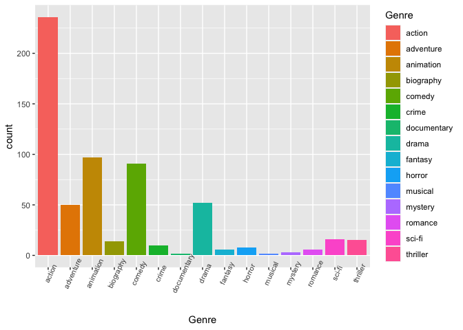
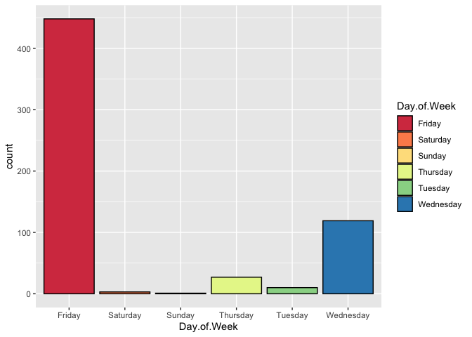
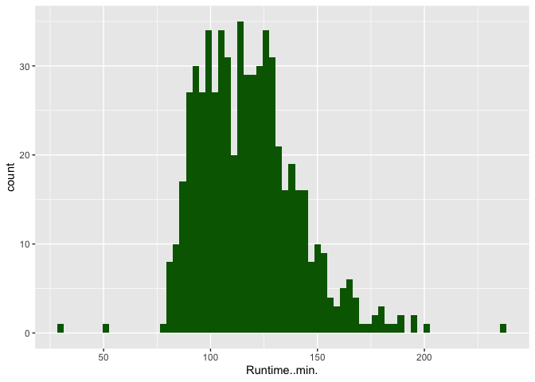
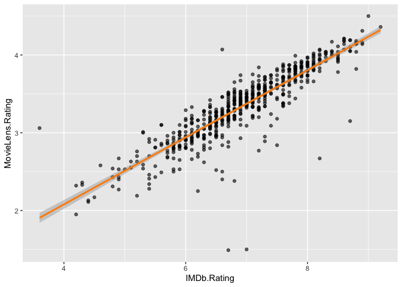
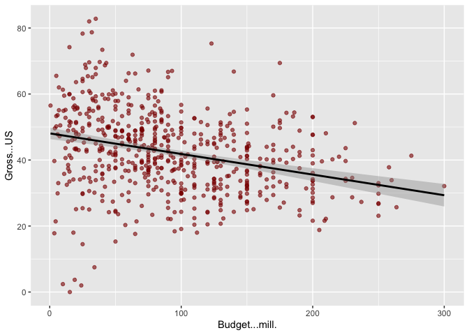
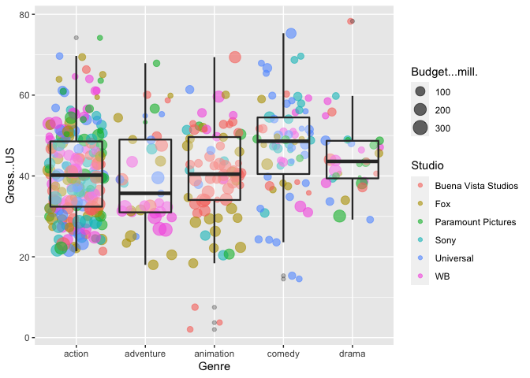

Data Analysis and Visualization with Movie Data
================

In this project I will analyze and visualize different variables of
movie data. I will try to find and display different patterns and trends
that could be found by analyzing the dataset. I will pose questions and
then promptly answer them with a visualization and/or quick written
analysis.The data comes in the form of a csv file and is listed below.

Credit to [SuperDataScience](https://www.superdatascience.com/) for
providing the data in this format.

``` r
data <- read.csv("MovieData.csv")
#Quick summary of data
head(data)
```

    ##   Day.of.Week                Director  Genre       Movie.Title Release.Date
    ## 1      Friday               Brad Bird action      Tomorrowland   22/05/2015
    ## 2      Friday             Scott Waugh action    Need for Speed   14/03/2014
    ## 3      Friday          Patrick Hughes action The Expendables 3   15/08/2014
    ## 4      Friday Phil Lord, Chris Miller comedy    21 Jump Street   16/03/2012
    ## 5      Friday         Roland Emmerich action  White House Down   28/06/2013
    ## 6      Friday              David Ayer action              Fury   17/10/2014
    ##                Studio Adjusted.Gross...mill. Budget...mill. Gross...mill.
    ## 1 Buena Vista Studios                  202.1            170         202.1
    ## 2 Buena Vista Studios                  204.2             66         203.3
    ## 3           Lionsgate                  207.1            100         206.2
    ## 4                Sony                  208.8             42         201.6
    ## 5                Sony                  209.7            150         205.4
    ## 6                Sony                  212.8             80         211.8
    ##   IMDb.Rating MovieLens.Rating Overseas...mill. Overseas. Profit...mill.
    ## 1         6.7             3.26            111.9      55.4           32.1
    ## 2         6.6             2.97            159.7      78.6          137.3
    ## 3         6.1             2.93            166.9      80.9          106.2
    ## 4         7.2             3.62             63.1      31.3          159.6
    ## 5         8.0             3.65            132.3      64.4           55.4
    ## 6         5.8             2.85              126      59.5          131.8
    ##   Profit. Runtime..min. US...mill. Gross...US
    ## 1    18.9           130       90.2       44.6
    ## 2   208.0           132       43.6       21.4
    ## 3   106.2           126       39.3       19.1
    ## 4   380.0           109      138.4       68.7
    ## 5    36.9           131       73.1       35.6
    ## 6   164.8           134       85.8       40.5

``` r
summary(data)
```

    ##     Day.of.Week              Director         Genre    
    ##  Friday   :448   Steven Spielberg: 19   action   :236  
    ##  Saturday :  3   Robert Zemeckis :  9   animation: 97  
    ##  Sunday   :  1   Michael Bay     :  8   comedy   : 91  
    ##  Thursday : 27   Peter Jackson   :  7   drama    : 52  
    ##  Tuesday  : 10   Ridley Scott    :  7   adventure: 50  
    ##  Wednesday:119   Tim Burton      :  7   sci-fi   : 16  
    ##                  (Other)         :551   (Other)  : 66  
    ##                 Movie.Title      Release.Date                 Studio   
    ##  10,000 B.C.          :  1   25/12/2008:  4   Buena Vista Studios: 93  
    ##  101 Dalmatians       :  1   1/07/2009 :  3   WB                 : 93  
    ##  101 Dalmatians (1996):  1   16/12/2011:  3   Fox                : 85  
    ##  2 Fast 2 Furious     :  1   19/11/1999:  3   Universal          : 79  
    ##  2012                 :  1   1/05/2009 :  2   Sony               : 65  
    ##  21 Jump Street       :  1   10/06/2005:  2   Paramount Pictures : 62  
    ##  (Other)              :602   (Other)   :591   (Other)            :131  
    ##  Adjusted.Gross...mill. Budget...mill.   Gross...mill.  IMDb.Rating   
    ##  296    :  3            Min.   :  0.60   202    :  3   Min.   :3.600  
    ##  231    :  2            1st Qu.: 45.00   211.8  :  3   1st Qu.:6.375  
    ##  269.4  :  2            Median : 80.00   214    :  3   Median :6.900  
    ##  274    :  2            Mean   : 92.47   215.9  :  3   Mean   :6.924  
    ##  280    :  2            3rd Qu.:130.00   245.7  :  3   3rd Qu.:7.600  
    ##  294.3  :  2            Max.   :300.00   201.6  :  2   Max.   :9.200  
    ##  (Other):595                             (Other):591                  
    ##  MovieLens.Rating Overseas...mill.   Overseas.     Profit...mill.
    ##  Min.   :1.490    106    :  3      Min.   : 17.2   180.7  :  3   
    ##  1st Qu.:3.038    111.9  :  3      1st Qu.: 49.9   245.7  :  3   
    ##  Median :3.365    140    :  3      Median : 58.2   127.5  :  2   
    ##  Mean   :3.340    150    :  3      Mean   : 57.7   140.7  :  2   
    ##  3rd Qu.:3.672    193    :  3      3rd Qu.: 66.3   168.4  :  2   
    ##  Max.   :4.500    338.7  :  3      Max.   :100.0   182.7  :  2   
    ##                   (Other):590                      (Other):594   
    ##     Profit.        Runtime..min.     US...mill.      Gross...US  
    ##  Min.   :    7.7   Min.   : 30.0   Min.   :  0.0   Min.   : 0.0  
    ##  1st Qu.:  201.8   1st Qu.:100.0   1st Qu.:107.0   1st Qu.:33.7  
    ##  Median :  338.6   Median :116.0   Median :141.7   Median :41.8  
    ##  Mean   :  719.3   Mean   :117.8   Mean   :167.1   Mean   :42.3  
    ##  3rd Qu.:  650.1   3rd Qu.:130.2   3rd Qu.:202.1   3rd Qu.:50.1  
    ##  Max.   :41333.3   Max.   :238.0   Max.   :760.5   Max.   :82.8  
    ## 

``` r
str(data)
```

    ## 'data.frame':    608 obs. of  18 variables:
    ##  $ Day.of.Week           : Factor w/ 6 levels "Friday","Saturday",..: 1 1 1 1 1 1 4 1 1 1 ...
    ##  $ Director              : Factor w/ 337 levels "Aaron Blaise, Robert A. Walker",..: 31 297 233 256 287 76 276 71 108 126 ...
    ##  $ Genre                 : Factor w/ 15 levels "action","adventure",..: 1 1 1 5 1 1 2 1 1 10 ...
    ##  $ Movie.Title           : Factor w/ 608 levels "10,000 B.C.",..: 557 314 466 6 592 161 233 378 128 331 ...
    ##  $ Release.Date          : Factor w/ 534 levels "1/05/2009","1/05/2015",..: 273 86 121 134 384 159 347 16 28 257 ...
    ##  $ Studio                : Factor w/ 36 levels "Art House Studios",..: 2 2 11 25 25 25 2 31 31 20 ...
    ##  $ Adjusted.Gross...mill.: Factor w/ 585 levels "1,003","1,020",..: 50 51 52 53 54 55 56 57 58 59 ...
    ##  $ Budget...mill.        : num  170 66 100 42 150 80 50 85 70 5 ...
    ##  $ Gross...mill.         : Factor w/ 561 levels "1,004.60","1,017",..: 30 33 43 27 40 59 63 49 72 45 ...
    ##  $ IMDb.Rating           : num  6.7 6.6 6.1 7.2 8 5.8 6 6.8 6.3 5.9 ...
    ##  $ MovieLens.Rating      : num  3.26 2.97 2.93 3.62 3.65 2.85 3.16 3.45 2.92 2.9 ...
    ##  $ Overseas...mill.      : Factor w/ 551 levels "1,160.60","1,528.10",..: 32 151 172 490 82 66 528 523 150 11 ...
    ##  $ Overseas.             : num  55.4 78.6 80.9 31.3 64.4 59.5 39.9 39.3 73.9 49.8 ...
    ##  $ Profit...mill.        : Factor w/ 566 levels "1,015.40","1,025.90",..: 366 47 13 94 494 39 100 28 69 189 ...
    ##  $ Profit.               : num  18.9 208 106.2 380 36.9 ...
    ##  $ Runtime..min.         : int  130 132 126 109 131 134 125 115 92 84 ...
    ##  $ US...mill.            : num  90.2 43.6 39.3 138.4 73.1 ...
    ##  $ Gross...US            : num  44.6 21.4 19.1 68.7 35.6 40.5 60.1 60.7 26.1 50.2 ...

``` r
#Activate ggplot2 package for plotting
library(ggplot2)
```

Now that we have our data imported, we can look at varying questions
that could arise when dealing with this particular dataset. Let’s start
with simple questions.

1)  How many movies of each genre are there?

<!-- end list -->

``` r
ggplot(data, aes(x=Genre,fill=Genre)) + geom_bar() + 
  theme(axis.text.x=element_text(size=8,angle=65))
```

<!-- -->

There are a lot more action movies in this dataset than any other genre
of movie.

2)  How many movies were released on each day of the week?

<!-- end list -->

``` r
ggplot(data, aes(x=Day.of.Week,fill=Day.of.Week)) + geom_bar(color="black") +
  scale_fill_brewer(palette="Spectral")
```

<!-- -->

Most movies were released on Friday, with the second most populated day
being Wednesday.

3)  What is the distribution of movie runtimes?

<!-- end list -->

``` r
ggplot(data, aes(x=Runtime..min.)) + geom_histogram(binwidth=3,fill="darkgreen")
```

<!-- -->

Most movie runtimes hover around the 100-125 minute mark, although there
are a few outliers on the short and long end of the spectrum.

Now let’s try to answer more complex questions involving two variables.

4)  Is there a relationship between IMDb ratings and MovieLens ratings?

<!-- end list -->

``` r
ggplot(data, aes(x=IMDb.Rating,y=MovieLens.Rating)) + geom_point(alpha=0.6) + 
  geom_smooth(method=lm,color="darkorange")
```

    ## `geom_smooth()` using formula 'y ~ x'

<!-- -->

There seems to be a strong positive correlation between IMDb ratings and
MovieLens ratings. There are only a couple of extreme outliers. The
confidence is high for most of the line, with some variation near the
head and tail of the line.

5)  Do movies that have a higher budget typically have higher gross %
    amounts in the US?

<!-- end list -->

``` r
ggplot(data, aes(x=Budget...mill.,y=Gross...US)) + 
  geom_point(color="darkred",alpha=0.6) + 
  geom_smooth(method=lm,color="black")
```

    ## `geom_smooth()` using formula 'y ~ x'

<!-- -->

It seems there is a negative correlation between budget and gross % in
the US, although it is slight. The plot tells us that higher budget
movies tend to gross more outside of the US than in the US.

Lastly, let’s make our most complex visual yet. We will create a visual
that compares genre, studio, budget, and gross % in the US. Notice that
there are a lot of genres and studios within our dataset, so much that
there would not be enough room to fit on one graph. Let’s instead filter
out the genres and studios that we want to leave out, so that we may be
left with a workable number genres and studios.

``` r
#Create the filters
genre_filter <- data$Genre %in% c("action","adventure","animation","comedy","drama")
studio_filter <- data$Studio %in% c("Buena Vista Studios","Fox","Paramount Pictures","Sony","Universal","WB")

#Create new filtered dataset
filtered_data <- data[genre_filter & studio_filter,]
```

Now that we have our filtered dataset, we can start visualizing all of
our variables on one graph. We can do this by adding multiple layers of
geometries to represent all of our variables in different ways.

``` r
ggplot(filtered_data,aes(x=Genre,y=Gross...US)) + geom_jitter(aes(size=Budget...mill.,color=Studio),alpha=0.6) + geom_boxplot(lwd=0.8,alpha=0.3)
```

<!-- -->

Multiple things can be said using the information from this graph, some
being the following:

  - Buena Vista Studios is the most common studio in animation, while
    Universal is the most common studio in comedy.

  - Comedy has a higher percent US gross compared to the other genres.

  - Action not only has the highest population of movies, but also tends
    to have the highest budgets.
